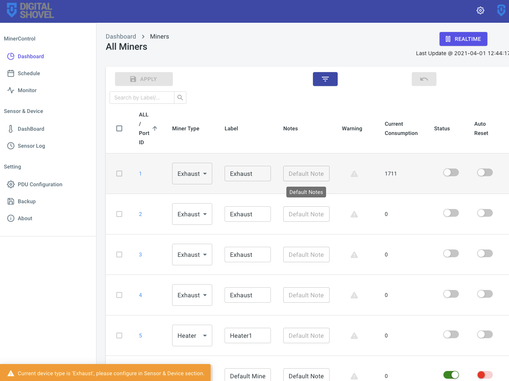

# Quick Start

## Introduction

**MinerControl** section provides a dashboard to control devices in a simple way.

## 1. Check Miner Info

### 1.1 Show more fields

### 1.2 Check Miner History

Users can review each miner's **consumption** and **operation** history on details page.

## 2. Update Miner

### 2.1 One Miner

1. Select Miner
2. Change field
3. Click `Apply` Button
4. `Undo` Button is available 

### 2.2 Multiple Miners

1. Select multiple Miner
2. All changes for one miner will apply to other selected miners

