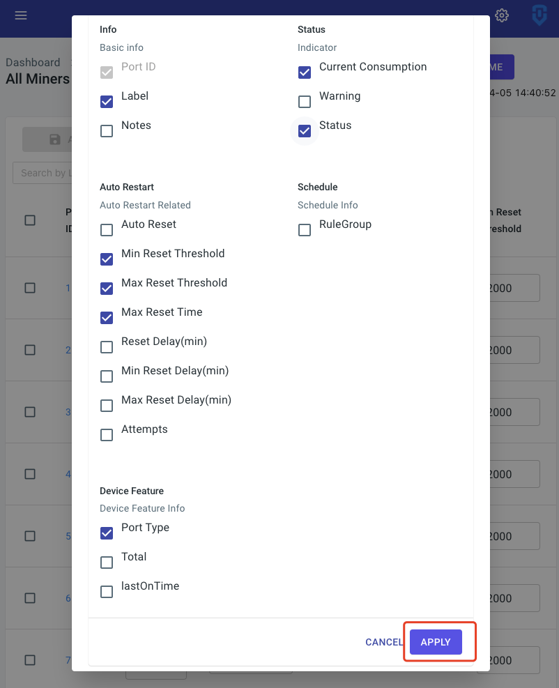

# Feature

## 1. Use Miner as Utilities

Allow customers to use spare ports for other purposes. Customers can change Port Type.

### 1.1 Usage

For example, a Smart PDU has 46 ports, one customer uses 43 ports for `Miner`, 4 ports for `Exhaust`, and 1 port for `Heater`. In this case, customers can do the following:

1. Go to Dashboard, change ID 1-4 ports `Type` to `Exhaust`.
2. Change ID 5 ports `Type` to `Heater`.
3. In this case, users **are not able** to control Port 1-5. 
4. Go to `Sensor & Device` -&gt; `DashBoard`
5. Setup device and drag to reset priority.

## 2. Build-in API Docs

Location: `Setting` -&gt; `About` -&gt; `Documentation`. 

Every Smart PDU comes with APIs which allow developers to control it.

